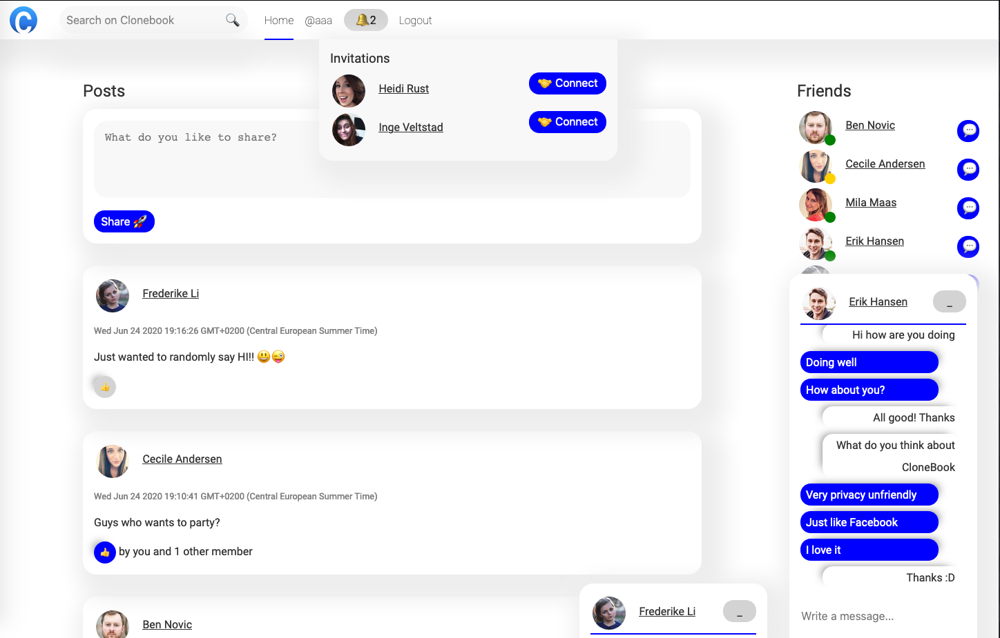

# CloneBook

A social media platform build in Svelte with Sapper, SocketIO and MongoDB.
This is an exam project for Copenhagen School of Design and Technology.

Unfortunately due to the structure of Sapper it is not possible to use server sent events.
By using SocketIO, the app provides real time data in Svelte in order to chat. 

# Screenshot

# Functionality:  
- Online status 
- Signup
- Login
- Logout
- Change details about you
- Upload a profile picture
- Search for username, first name and last name
- Connect with users
- Notifications
- Simple chat
- Create a post
- Like a post
